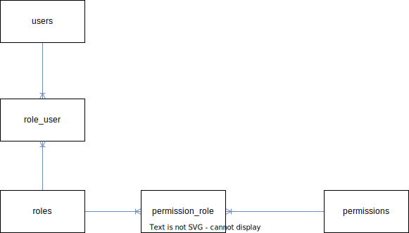

# Roles and permissions workflow

## roles Table

- **id** (Primary Key): INT
- name: VARCHAR

## permissions Table

- **id** (Primary Key): INT
- name: VARCHAR

## role_user Table

- **user_id** (Foreign Key): INT (References user Table)
- **role_id** (Foreign Key): INT (References role Table)

## permission_role Table

- **role_id** (Foreign Key): INT (References role Table)
- **permission_id** (Foreign Key): INT (References permission Table)

---

# Diagram

