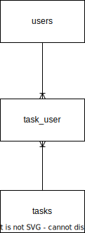

# TASKS WORKFLOW

## tasks Table

- **id** (Primary Key): INT
- **name** VARCHAR
- **description** VARCHAR **-> (CHANGE TO TEXT)**
- **user_id**: (Foreign Key): INT (References users Table)

## task_user Table

- **task_id**: (Foreign Key): INT (References tasks Table)
- **user_id**: (Foreign Key): INT (References users Table)

